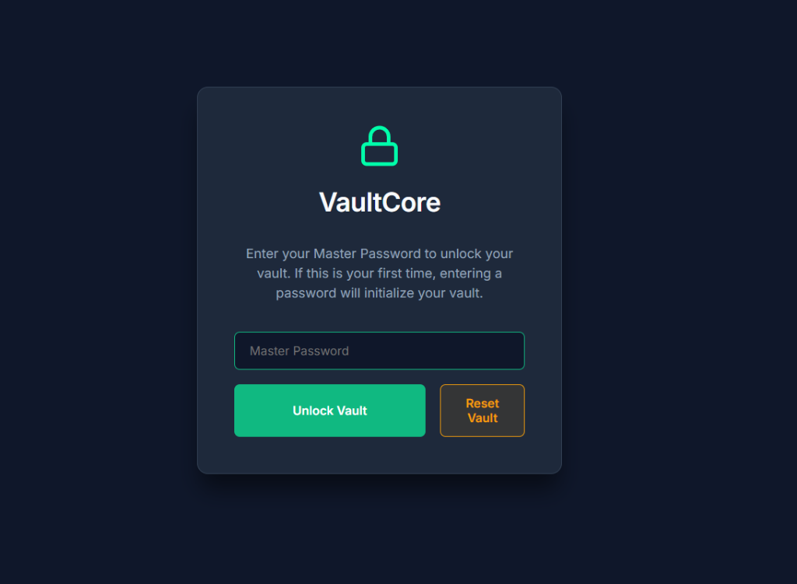
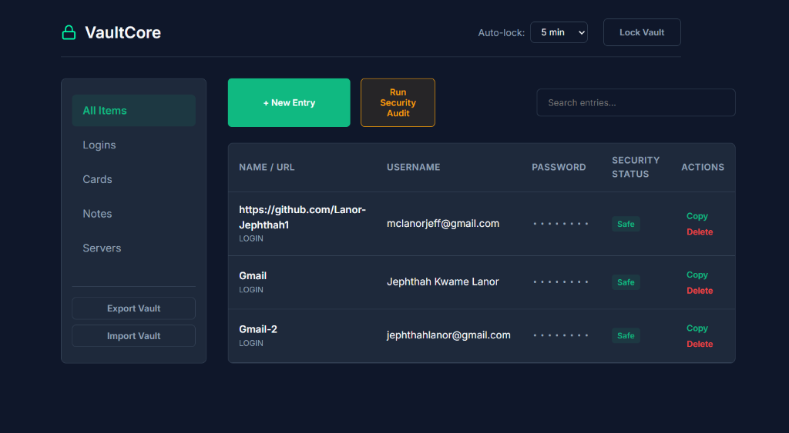

# VaultCore

A completely local-first, zero-knowledge secure password manager running entirely in your browser with a SQLite/PostgreSQL backend. It features native Web Crypto API AES-GCM encryption, HaveIBeenPwned API auditing using k-Anonymity, and a suite of premium usability upgrades.




## Features

- **Zero-Knowledge Architecture:** Your Master Password is never saved anywhere. The vault is encrypted client-side using native browser `SubtleCrypto` PBKDF2 key derivation (100,000 iterations) and AES-GCM 256-bit symmetric encryption.
- **SQLite Database Backend:** Stores your encrypted vault safely in a local SQLite database (`vault.db`) via a Python server instead of ephemeral storage.
- **Vercel & PostgreSQL Support:** Fully compatible with Vercel serverless deployments. Integrates with cloud PostgreSQL databases (like Neon or Supabase) when configured with the `DATABASE_URL` environment variable.
- **Secure Reset Token:** Wiping the vault is protected by an `ADMIN_KEY` environment check to prevent unauthorized database resets on public deployments.
- **k-Anonymity Auditing:** Check your passwords against 10+ billion compromised credentials without transmitting your actual password. Only the first 5 characters of your password's SHA-1 hash are sent to the HaveIBeenPwned API; matching is finished locally.
- **Interactive Password Generator:** Customize character length (8 to 64) and toggle letters, numbers, and symbols with a live preview.
- **Organized Categories:** Separate your credentials into Logins, Cards, Notes, and Servers with custom visual masking and copy actions (e.g. masking card numbers and separate PIN copying).
- **Auto-Lock Timer:** Secure your vault with an auto-lock interval (5 min, 15 min, 1 hour) based on user inactivity, or lock instantly when browser tabs are switched or hidden.
- **Live Search:** Fast search bar to dynamically filter vault entries as you type.
- **Encrypted JSON Import/Export:** Securely backup your vault to a downloaded JSON file (which can only be decrypted using your master password) and restore it on any device.

## Tech Stack
- HTML5, CSS3 (Glassmorphism Dark Theme), Vanilla JavaScript
- **Web Crypto API:** Native browser cryptography.
- **Python / SQLite:** Local storage backend.
- **pg8000:** Pure-Python PostgreSQL connector for serverless Vercel function compatibility.

## How to Run Locally

Since the application relies on native browser APIs, you must run it with the backend server.

1. **Start the local HTTP server:**
   ```bash
   python server.py
   ```
2. **Access the application:**
   Open [http://localhost:8000](http://localhost:8000) in your web browser.

## Deploying to Vercel

VaultCore is fully configured for Vercel out of the box.

1. Install the Vercel CLI and login.
2. Link your repository.
3. Configure the following **Environment Variables** in your Vercel Dashboard:
   - `DATABASE_URL`: Your cloud PostgreSQL database connection string (e.g., from Neon or Supabase).
   - `ADMIN_KEY`: (Optional) A secret token required to authorize resetting/wiping the database from the UI.
4. Deploy using `vercel`.

## Security Warning
> **IMPORTANT:** Because this is a zero-knowledge local vault, there is absolutely no password reset feature. If you forget your Master Password, your encrypted vault data is permanently unrecoverable.

## License
MIT License
